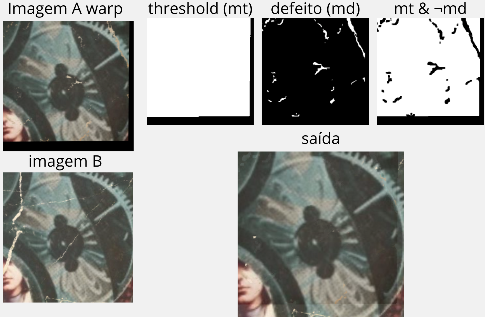

### Synthetic Data Generation ###
To generate multiple images with different degradation types and 
camera angles from a given ground truth image run the script 
[dataGeneration/synthesize.py](./dataGeneration/synthesize.py). 
The options dictionary in the file can be modified for customizing 
the output.

### Homography ###
Transform coordinates of points from one image to a reference 
image space using a homography matrix. Check 
[alignment/warp](./alignment/warp.py) and 
[alignment/homography.py](./alignment/homography.py) 
for more details on how to find the homography between images using 
key-points and applying the transformation.

Alignment can be realized with the support of masks retrieved from
 scratch detection to combine both images scratch-less regions. 

### Evaluation ###
Evaluate the similarity between aligned images using different 
methods for choosing key points to find homography matrix 
between images.

